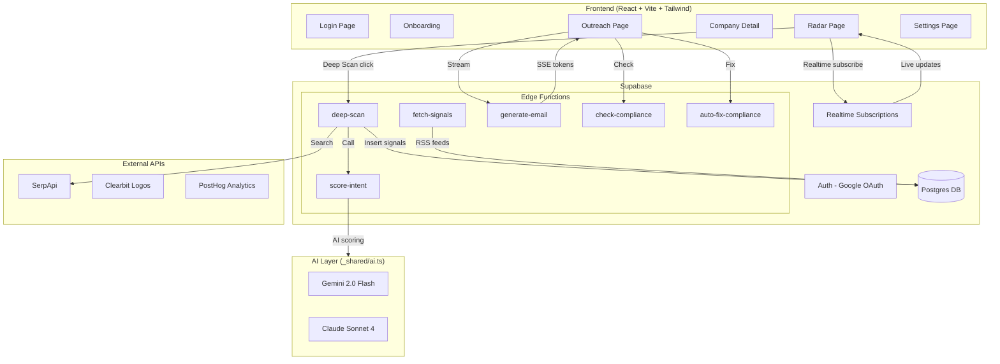

# BlostemPulse — Implementation Plan & Architecture Analysis

## What Is BlostemPulse?

An **AI-powered B2B sales intelligence dashboard** for Indian fintech. It automatically discovers prospects, scores their purchase intent using AI, generates compliant outreach emails, and surfaces macro regulatory events (RBI/SEBI) — all in real time.

---

## The Core Question: Does This Solve "Showing Real-Time Loading of Fintech Companies to Judges"?

### Honest Assessment: **Partially Yes, But With Critical Gaps**

Here's what the guides get right and what they miss:

#### ✅ What Works Well

| Strength | Why It Matters for Demo |
|---|---|
| **Deep Scan with live score animation** | Judge clicks "Run Deep Scan" → sees SerpApi fetch real news → AI re-scores → score animates up/down with `+12 pts` flash. This is the **money moment**. |
| **Streaming email generation (SSE)** | Tokens appear word-by-word in the UI. Visually impressive. Judges can see AI "thinking." |
| **Compliance check with auto-fix** | After email generates, compliance runs automatically, flags appear inline, "Auto-Fix All" rewrites in one click. This is a **wow loop**. |
| **Signal decay + freshness UX** | Rows fade based on signal age, `NEW` badges pulse — the radar feels alive. |
| **AI provider swap (Gemini ↔ Claude)** | The adapter pattern in `_shared/ai.ts` is clean. One env var change, zero code changes. Smart engineering for a hackathon. |

#### ⚠️ Critical Gaps — Things That Will Break the "Real-Time" Illusion

| Gap | Problem | Fix Needed |
|---|---|---|
| **No Supabase Realtime subscriptions** | The guides use `SELECT` queries on mount. If a cron job or another tab updates data, the dashboard is stale. Judges won't see live updates unless they refresh. | Add `supabase.channel('prospects').on('postgres_changes', ...)` to auto-update the UI. |
| **Cron-based signal fetching is invisible** | `pg_cron` runs every 12 hours. During a 10-min demo, zero signals will arrive organically. | The guide's "Load demo signals" button in Settings (Prompt 6.3) partially fixes this, but it's a **manual hack**, not "real-time." |
| **No loading orchestration for first impression** | When a judge opens the Radar page, they see a static list. There's no "wow" moment on page load. | Add a **staggered card entrance animation** (cards slide in one by one with 100ms delay) + an initial auto-scan animation. |
| **Deep Scan depends on SerpApi** | SerpApi has rate limits. If the key is exhausted during demo, Deep Scan returns nothing. | Need a **fallback**: cache 2-3 pre-fetched results per company in Supabase, serve those if SerpApi fails. |
| **No WebSocket/Realtime for score updates** | After Deep Scan completes, only the triggering browser updates. If a judge is watching on a projector while you demo on your laptop, the projector view is stale. | Use Supabase Realtime to broadcast score changes. |

#### 🎯 Verdict

The build guide gives you a **strong product** but a **mediocre demo**. The "real-time" feel requires three additions:

1. **Supabase Realtime subscriptions** on prospects + signals tables
2. **Entrance animations** on the Radar page (staggered card load)
3. **A "Live Demo" button** that triggers fetch-signals + score-intent in sequence with visible UI feedback at each step

With those three additions, the answer becomes **Yes — this absolutely solves your problem.**

---

## Proposed Architecture



---

## Proposed Changes

### Phase 1 — Project Scaffold & Foundation

#### [NEW] `package.json`, `vite.config.js`, `tailwind.config.js`, `postcss.config.js`
- React 18 + Vite 5 + TailwindCSS 3
- Dependencies: `@supabase/supabase-js`, `react-router-dom`, `lucide-react`, `posthog-js`, `framer-motion`
- `framer-motion` is **not in the original guide** but is critical for the entrance animations that make the demo feel real-time

#### [NEW] `src/index.css`
- CSS variables for the dark theme color system (from Prompt 1.1)
- Global styles, scrollbar styling, glassmorphism utilities

#### [NEW] `src/lib/supabase.js`
- Supabase client initialization with env vars

#### [NEW] `src/context/AuthContext.jsx`
- Auth state management, onAuthStateChange listener
- New user detection → onboarding redirect

#### [NEW] `src/components/AppShell.jsx`
- Sidebar navigation (collapsible)
- Top KPI strip with live stats
- Protected route wrapper

---

### Phase 2 — Supabase Database (Manual Steps)

> [!IMPORTANT]
> These SQL scripts must be run manually in the Supabase SQL Editor. I'll provide the exact SQL, but you need a Supabase project first.

#### Tables to create:
- `profiles` — user ICP settings, with RLS
- `prospects` — fintech companies with intent scores
- `signals` — news/events linked to prospects
- `macro_events` — RBI/SEBI regulatory alerts
- `emails_sent` — outreach history, with RLS

#### Seed data:
- 10 Indian fintech prospects (Razorpay, Slice, Jupiter, KreditBee, etc.)
- 3 macro events (RBI repo rate, Union Budget, SEBI KYC norms)

#### **[NEW — Not in original guide] Enable Realtime:**
```sql
-- Enable realtime on prospects and signals for live demo
ALTER PUBLICATION supabase_realtime ADD TABLE prospects;
ALTER PUBLICATION supabase_realtime ADD TABLE signals;
```

---

### Phase 3 — Edge Functions (Supabase)

#### [NEW] `supabase/functions/_shared/ai.ts`
- The adapter pattern from the AI swap guide
- `callAI()` for non-streaming (score-intent, compliance)
- `callAIStream()` for streaming (generate-email)
- Gemini as default, one env var to switch to Claude

#### [NEW] `supabase/functions/_shared/utils.ts`
- JSON parsing safety (strip markdown fences from Gemini responses)
- CORS headers helper

#### [NEW] `supabase/functions/score-intent/index.ts`
- Fetches company + signals + macro events + user ICP
- Builds structured prompt → calls `callAI()`
- Returns `{ score, reason, signal_weights }` and updates DB

#### [NEW] `supabase/functions/deep-scan/index.ts`
- Calls SerpApi for fresh news about a company
- Inserts results as signals
- Calls score-intent internally for rescoring
- Returns `{ new_score, delta, new_signals }`

#### [NEW] `supabase/functions/generate-email/index.ts`
- Builds persona-aware prompt (stakeholder + tone)
- Returns SSE stream via `callAIStream()`

#### [NEW] `supabase/functions/check-compliance/index.ts`
- 5 RBI/SEBI rule checks against email body
- Returns `{ passed, flags[] }`

#### [NEW] `supabase/functions/auto-fix-compliance/index.ts`
- Takes flagged sentences, rewrites only those
- Returns `{ fixed_email_body }`

#### [NEW] `supabase/functions/fetch-signals/index.ts`
- RSS feed parser (Inc42, ETBFSI, RBI)
- Matches headlines against prospect names
- Deduplicates by URL

---

### Phase 4 — Frontend Pages

#### [NEW] `src/pages/LoginPage.jsx`
- Dark theme, geometric accents
- Google OAuth + email/password
- "BLOSTEM PULSE" branding

#### [NEW] `src/pages/OnboardingPage.jsx`
- 3-step wizard: Company Type → Stage & Geography → ICP Description
- On complete: upsert profile + trigger async rescoring

#### [NEW] `src/pages/RadarPage.jsx` ⭐ **The Hero Page**
- Macro events banner (scrollable alert pills)
- Prospect list sorted by intent score
- **[ADDED] Staggered entrance animation** via framer-motion `AnimatePresence`
- **[ADDED] Supabase Realtime subscription** — UI auto-updates when scores change
- Deep Scan button with score delta animation (`+12 pts` flash)
- Signal decay (row opacity fades with age)
- `NEW` badge with pulse animation for new entrants
- **[ADDED] "Live Demo" button** — triggers fetch-signals → score-intent → visible update cascade

#### [NEW] `src/pages/CompanyDetailPage.jsx`
- Animated SVG score ring (0 → score on mount)
- Signal breakdown with source color coding
- AI alignment explanation (3 sections)
- Action bar: Generate Email, Deep Scan, Back

#### [NEW] `src/pages/OutreachPage.jsx`
- Split panel: prospect list (35%) + email workspace (65%)
- Stakeholder × Tone matrix selector
- **SSE streaming** — tokens appear word-by-word
- Auto-compliance check after generation
- Auto-fix with one click
- "Open in Gmail" mailto link

#### [NEW] `src/pages/SettingsPage.jsx`
- ICP configuration (pre-filled)
- Scan frequency controls
- **[ADDED] "Load Demo Signals" hidden button** (from Prompt 6.3) — inserts realistic headlines
- **[ADDED] "Run Full Demo Sequence" button** — orchestrates the entire flow for judges
- Danger zone (clear signals, reset scores)

---

### Phase 5 — Polish & Demo Readiness

#### [NEW] `src/components/Toast.jsx`
- Notification system (teal/amber/coral)
- Auto-dismiss with animation

#### [NEW] `src/components/SkeletonLoader.jsx`
- Pulse animation skeleton cards for loading states

#### [NEW] `src/hooks/useRealtimeProspects.js`
- **[ADDED — Not in original guide]**
- Supabase Realtime subscription hook
- Auto-updates prospect list when any row changes in `prospects` or `signals` table
- This is what makes the demo feel **truly real-time**

#### PostHog integration
- Event tracking across all key actions

---

## The "Judge Demo" Flow — How This Plays Out

Here's the exact sequence that will wow judges:

```
1. Open Radar Page
   → Cards stagger in with entrance animation (framer-motion)
   → 10 fintech companies visible, sorted by score
   → Macro events banner shows RBI/SEBI alerts

2. Click "Deep Scan" on KreditBee
   → Loading spinner on button
   → SerpApi fetches fresh news
   → Score animates: 91 → 97 (+6 pts flash in teal)
   → New signal cards slide in under the company
   → ALL OF THIS HAPPENS LIVE — no refresh needed

3. Click into KreditBee → Company Detail
   → Score ring animates from 0 to 97
   → Signal breakdown shows weighted contributions
   → AI explains WHY this company is a fit

4. Click "Generate Email" → Outreach Page
   → Select "CTO" + "Consultative" tone
   → Click Generate
   → Email streams in token-by-token (SSE)
   → Compliance auto-runs: "✓ Passed" or "⚠ 2 Issues"
   → If issues: click "Auto-Fix" → fixed email replaces original
   → Click "Open in Gmail" → done

5. Back to Radar → scores are live-updating
   → If you loaded demo signals in Settings, new data flows in
   → Realtime subscription keeps everything fresh
```

**Total demo time: ~3 minutes.** Every step has visible, animated feedback.

---

## Open Questions

> [!IMPORTANT]
> **Supabase Project**: Do you already have a Supabase project created? I need the URL and anon key to proceed. If not, I'll guide you through creating one.

> [!IMPORTANT]
> **API Keys**: Which of these do you have ready?
> - Google Gemini API key (free at aistudio.google.com)
> - SerpApi key (for Deep Scan — has a free tier)
> - Google OAuth credentials (for login)
> - PostHog project key (optional but nice for analytics)

> [!WARNING]
> **Anthropic API Key**: The build guide defaults to Claude, but the swap guide lets us start with **Gemini (free)**. I recommend building on Gemini first and swapping to Claude only if you get an Anthropic key. This saves money and the free Gemini tier (1,500 req/day) is more than enough for demo.

> [!IMPORTANT]
> **Deployment Target**: Are you deploying to Vercel for the demo, or running locally? This affects CORS config and OAuth redirect URLs.

---

## Build Order (Optimized for Demo Impact)

| Order | What | Time Est. | Why This Order |
|---|---|---|---|
| 1 | Scaffold (Vite + Tailwind + Router) | 15 min | Foundation |
| 2 | Supabase client + AuthContext | 15 min | Unblocks everything |
| 3 | DB schema + seed data (manual SQL) | 10 min | Need data to build against |
| 4 | App Shell + Sidebar | 20 min | Visual frame |
| 5 | **Radar Page** (static first) | 30 min | First working screen |
| 6 | `_shared/ai.ts` adapter | 10 min | Unblocks all AI functions |
| 7 | `score-intent` Edge Function | 20 min | Core AI feature |
| 8 | **Radar Page** (+ Deep Scan + Realtime) | 25 min | **Demo hero moment** |
| 9 | Company Detail Page | 25 min | Second demo screen |
| 10 | `generate-email` Edge Function | 15 min | Streaming setup |
| 11 | `check-compliance` + `auto-fix` | 15 min | Compliance loop |
| 12 | **Outreach Page** (streaming + compliance) | 30 min | **Second wow moment** |
| 13 | Login + Onboarding | 20 min | Auth flow |
| 14 | Settings + Demo triggers | 15 min | Demo readiness |
| 15 | Polish (animations, skeletons, toasts) | 20 min | Final shine |

**Total estimated: ~5 hours** of focused building.

---

## Verification Plan

### Automated Tests
- Run `npm run dev` and verify all routes render without errors
- Test each Edge Function independently via `curl` or Supabase dashboard
- Verify Supabase Realtime subscription fires on `UPDATE prospects`

### Manual Verification (Demo Rehearsal)
1. Full demo flow walkthrough (the 5-step sequence above)
2. Deep Scan with live SerpApi call — verify score animation
3. Email generation — verify SSE streaming works end-to-end
4. Compliance check — verify flags appear and auto-fix works
5. Test with SerpApi key exhausted — verify fallback behavior
6. Test on projector/secondary display — verify Realtime keeps it in sync

### Browser Recording
- Record a full demo flow video using the browser tool for reference
